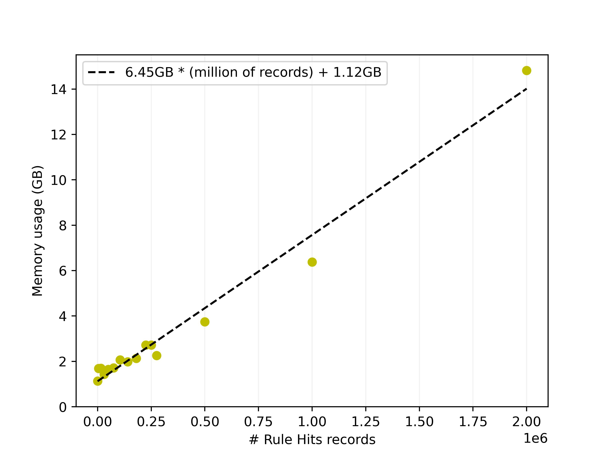

# Exporter

The [meassure_exporter_consumption.sh](meassure_exporter_consumption.sh) script lets you send messages to the db-writer (`./insights-results-aggregator`), wait for them to be aggregated (manual action) and run the exporter, while measuring the memory consumption.

It has a loop for checking different usages per messages sent.

The results of my tests are stored at [results.csv](results.csv):

| rule_hits_records | reports | recommendations | memory_consumption |
| ----------------- | ------- | --------------- | ------------------ |
| 0                 | 0       | 0               | 1132240            |
| 5000              | 1000    | 5000            | 1690672            |
| 15000             | 3000    | 15000           | 1691592            |
| 30000             | 6000    | 30000           | 1426608            |
| 50000             | 10000   | 50000           | 1643356            |
| 75000             | 15000   | 75000           | 1714588            |
| 105000            | 21000   | 105000          | 2066372            |
| 140000            | 28000   | 140000          | 1981964            |
| 180000            | 36000   | 180000          | 2128700            |
| 225000            | 45000   | 225000          | 2716640            |
| 250000            | 50000   | 250000          | 2718316            |
| 275000            | 55000   | 275000          | 2257340            |
| 500000            | 100000  | 500000          | 3741988            |
| 1000000           | 200000  | 1000000         | 6380436            |
| 2000000           | 400000  | 2000000         | 14821292           |

Then I plotted the consumption for the rule hits using [ploter.py](ploter.py):

But it can be plotted for other fields (reports and recommendations).

## Requirements

For running these tests you may need to deploy a compose with Kafka, Minio and Postgres. If you want to use [duplicate.sql](duplicate.sql) (a super-useful script for duplicating the data in the aggregator database), please use a Postgres 13 (at least) version as it uses a [gen_random_uuid](https://www.postgresql.org/docs/13/functions-uuid.html) function.

You also need to run `./insights-results-aggregator migration latest` and keep `./insights-results-aggregator` running while executing the [meassure_exporter_consumption.sh](meassure_exporter_consumption.sh) script.

You may also need to install `matplotlib`, `numpy`, `pandas` and `tqdm` :) .